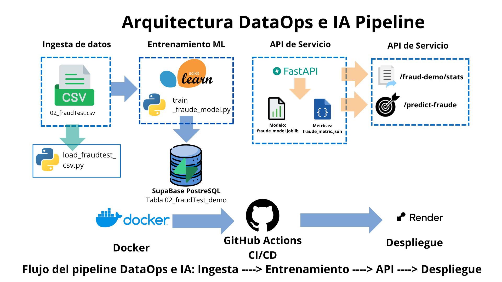

# Grupo_4
Gestión de datos para IA

# MVP DataOps CreditCardaFraud

Repositorio para preparar, probar y documentar un entorno técnico reproducible para soluciones de datos e IA.

## Objetivo
Entorno tecnico reproducible para entrenar un modelo IA que detecte fraudes de tarjetas de credito trabajando con:
- Python 3
- FastAPI
- Docker
- Git y GitHub
- GitHub Actions
- Render
- Supabase (PostgreSQL)
- Scikit-learn para un clasificador binario simple

## Arquitectura del MVP
La solución implementa una arquitectura IA híbrida simple:

- Aplicación Python dockerizada
- API con FastAPI
- CI/CD con GitHub Actions
- Despliegue en Render
- Base de datos PostgreSQL en Supabase
- Modelo de clasificación binaria con Arbol de decision

## Estructura del proyecto
```text
mvp-dataops-CreditCardFraud/
├─ .github/
│  └─ workflows/
│     └─ ci.yml
├─ app/
│  ├─ __init__.py
│  ├─ db.py
│  ├─ main.py
│  └─ predict.py
├─ artifacts/
│  ├─ fraude_metrics.json
│  └─ fraude_model.joblib
├─ data/
  └─ 02_fraudTest.csv (url del drive en donde esta el csv)
├─ scripts/
│  ├─ correr_pipeline.py
│  ├─ limpieza_fraud_pipeline.py
│  ├─ load_fraudtest_csv.py
│  ├─ train_fraud_model.py
│  └─ validate_frautest.py
├─ tests/
│  └─ test_health.py
├─ .dockerignore
├─ .env.example
├─ .gitignore
├─ Dockerfile
├─ README.md
├─ render.yaml
└─ requirements.txt
```

## Flujo implementado
1. Se dispone de un archivo CSV de ejemplo en data/02_fraudTest.csv
2. Se validan y limpian los datos mediante scripts
3. Se crea una tabla destino en Supabase: `public.fraudtest_demo`
4. Un script Python carga los datos del CSV a Supabase
5. Se entrena un modelo de clasificación binaria para detectar `FRAUDE`
6. Se guardan los artefactos del modelo en artifacts/
7. La API consulta esos datos y los expone en JSON
8. El proyecto se despliega usando Render y Power Bi

## Dataset y variable objetivo
Se utliza el dataset de `fraudeTest` y la variable objetivo es:

`is_fraud`  valores `SI` / `NO`

Para el MVP se implemento el clasificador binario con el Arbol de decision,
